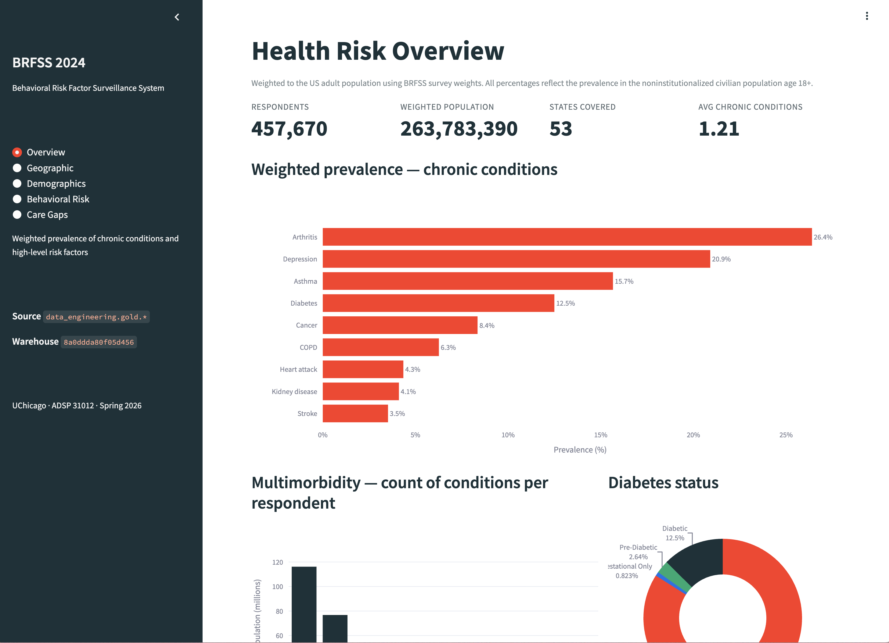
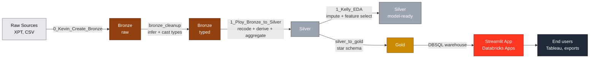

<div align="center">

# BRFSS 2024 — Behavioral Risk & Chronic Disease Analytics

https://github.com/user-attachments/assets/5bcaf4a0-3133-4e8f-8f9f-9055b349e1a6




[Live Website](https://brfss-analytics-7474658763286946.aws.databricksapps.com)


**A medallion-architecture data pipeline that transforms the CDC's Behavioral Risk Factor Surveillance System into analysis-ready datasets, plus a Databricks App that surfaces them as interactive dashboards.**

[](https://www.python.org/)
[](https://www.databricks.com/)
[](https://delta.io/)
[](https://spark.apache.org/)
[](#)
[](https://streamlit.io/)
[](https://plotly.com/python/)
[](https://docs.databricks.com/aws/en/dev-tools/bundles/)
[](https://pandas.pydata.org/)
[](#)
[](#)

</div>

---

## Table of Contents

- [Executive Summary](#executive-summary)
- [Business Case](#business-case)
- [Data Sources](#data-sources)
- [Architecture](#architecture)
- [Repository Structure](#repository-structure)
  - [Notebooks](#notebooks)
  - [Streamlit App](#streamlit-app)
  - [Databricks Asset Bundle](#databricks-asset-bundle)
- [Pipeline Walkthrough](#pipeline-walkthrough)
- [The Dashboard App](#the-dashboard-app)
- [Quickstart](#quickstart)
  - [Run the data pipeline](#run-the-data-pipeline)
  - [Deploy the app](#deploy-the-app)
  - [Local development](#local-development)
- [Tech Stack](#tech-stack)
- [Deliverables & Roadmap](#deliverables--roadmap)

---

## Executive Summary

Chronic diseases — including diabetes, heart disease, and stroke — account for **7 in 10 deaths** in the United States each year and represent the single largest driver of national healthcare costs. Despite this concentration of impact, prevention budgets are allocated uniformly across populations rather than targeted at the highest-risk segments.

This project uses the CDC's **Behavioral Risk Factor Surveillance System (BRFSS) 2024** to identify where behavioral risk is most concentrated, how it varies by geography and demographics, and where prevention dollars would deliver the greatest marginal impact.

## Business Case

Federal, state, and county health departments allocate hundreds of millions of dollars annually to chronic disease prevention. These budgets are typically distributed broadly rather than targeted by behavioral risk profile or geography. Stakeholders — government health departments, the CDC, and CMS — need to answer three questions:

1. **Which behavioral risk factors most strongly predict chronic disease diagnoses?**
2. **How do risk profiles vary by state, income bracket, and age group?**
3. **Where are populations engaging in high-risk behaviors but not accessing preventive care?**

To address these, the project produces three downstream deliverables:

| # | Deliverable | Primary Audience |
|---|---|---|
| 1 | Behavioral risk **clustering analysis** by demographic group | Epidemiologists, program designers |
| 2 | State-level **benchmarking dashboard** | State & county health departments |
| 3 | Preventive **care gap report** | CMS, federal policy analysts |

All three are surfaced through the interactive Streamlit dashboard described below.

## Data Sources

| Dataset | Source | Granularity | Rows | Cols |
|---|---|---|---:|---:|
| **BRFSS 2024** | [CDC BRFSS Annual Data](https://www.cdc.gov/brfss/annual_data/annual_2024.html) | One row per respondent | 457,670 | 345 |
| **SVI 2022** | [CDC/ATSDR Social Vulnerability Index](https://www.atsdr.cdc.gov/place-health/php/svi/index.html) | One row per US county | 3,144 | 158 |
| **Medicaid Expansion** | [KFF State Health Facts](https://www.kff.org/) | One row per state | 54 | 6 |

## Architecture

The pipeline follows a **medallion architecture** in Databricks Unity Catalog. Each layer is progressively cleaner, more typed, and more analytically useful than the layer below. The gold layer is consumed by a Streamlit-based Databricks App.



**Unity Catalog:** `data_engineering`

| Layer | Table | Description |
|---|---|---|
| Bronze | `bronze.brfss_2024` | Raw BRFSS survey records (typed by `bronze_cleanup`) |
| Bronze | `bronze.svi_2022_us_county` | Raw county-level SVI |
| Bronze | `bronze.medicaid_expansion_status_raw` | Raw KFF state policy |
| Silver | `silver.brfss_2024_transformed` | Recoded + derived BRFSS, one row per respondent |
| Silver | `silver.svi_2022_state_transformed` | Population-weighted state-level SVI |
| Silver | `silver.medicaid_expansion_clean_transformed` | Cleaned state expansion policy + territories |
| Gold | `gold.dim_location`, `dim_svi`, `dim_medicaid`, `dim_respondent`, `dim_behavior`, `dim_chronic_condition`, `dim_healthcare_access`, `dim_preventive_care`, `dim_time` | Star-schema dimensions |
| Gold | `gold.fact_health_response` | Fact table — one row per respondent, with seven dim FKs and survey measures |

## Repository Structure

```text
DataEngineering_Final/
├── README.md
├── requirements.txt                   # Notebook deps for local exploration
├── raw_brfss_2024.parquet             # Pre-ingest snapshot of BRFSS XPT
├── databricks.yml                     # DAB — declares the app + bound warehouse
├── notebooks/                         # Mirrors /Data_Engineering_Notebooks/ in the workspace
│   ├── 0_Kevin_Create_Bronze.ipynb
│   ├── bronze_cleanup.ipynb
│   ├── 1_Ploy_Bronze_to_Silver.ipynb
│   ├── 1_Kelly_EDA.ipynb
│   └── silver_to_gold.ipynb
└── app/                               # Databricks App source
    ├── app.yaml                       # Apps runtime command + env
    ├── app.py                         # Streamlit dashboard entry point
    ├── requirements.txt               # App-specific Python deps
    └── .streamlit/config.toml         # Databricks-branded theme
```

### Notebooks

The `notebooks/` directory is an exact mirror of `/Data_Engineering_Notebooks/` in the Databricks workspace. Run them in workspace; the local copies exist for version control and review.

| File | Workspace path | Role |
|---|---|---|
| `0_Kevin_Create_Bronze.ipynb` | `/Data_Engineering_Notebooks/0_Kevin_Create_Bronze` | Ingests raw sources → `bronze.*` |
| `bronze_cleanup.ipynb` | `/Data_Engineering_Notebooks/bronze_cleanup` | Per-column type inference; overwrites `bronze.brfss_2024` |
| `1_Ploy_Bronze_to_Silver.ipynb` | `/Data_Engineering_Notebooks/1_Ploy_Bronze_to_Silver` | Recoding, derived columns, state aggregation → silver |
| `1_Kelly_EDA.ipynb` | `/Data_Engineering_Notebooks/1_Kelly_EDA` | Exploratory analysis + model-prep silver output |
| `silver_to_gold.ipynb` | `/Data_Engineering_Notebooks/silver_to_gold` | Builds the star schema in `data_engineering.gold` |

### Streamlit App

The `app/` directory contains a Databricks App that consumes the gold tables via a bound SQL warehouse and renders five views:

1. **Overview** — weighted chronic-condition prevalence, multimorbidity histogram, diabetes status breakdown.
2. **Geographic** — choropleth map of state-level prevalence with SVI/Medicaid overlays.
3. **Demographics** — age × sex, race/ethnicity, education, income.
4. **Behavioral Risk** — smoking, drinking, exercise, BMI; BMI × diabetes prevalence.
5. **Care Gaps** — preventive uptake by insurance status, cost barriers vs. condition burden, PCP access.

All visualizations use Plotly with a custom Databricks-branded template (`#FF3621` accent, `#1B3139` text, off-white background). Queries are cached in Streamlit for one hour.

### Databricks Asset Bundle

`databricks.yml` declares one resource — the Databricks App — with a bound SQL warehouse. The warehouse ID is parameterized via the `warehouse_id` bundle variable (default: the workspace's Serverless Starter Warehouse). The `dev` target points at `https://dbc-670721c9-ce87.cloud.databricks.com`.

## Pipeline Walkthrough

The pipeline is designed to run **sequentially**. Each step depends on the prior layer being clean and typed correctly.

### Step 0 — Bronze Ingestion (`0_Kevin_Create_Bronze`)

Ingests the raw BRFSS XPT, SVI county CSV, and KFF Medicaid CSV into the `bronze.*` tables. One-time setup.

### Step 1 — Bronze Type Cleanup (`bronze_cleanup`)

The raw BRFSS bronze table was ingested with every column typed as `string`. This step does a best-effort per-column cast:

| Signal in the data | Inferred type |
|---|---|
| Contains `.` anywhere | `double` |
| Starts with `0` then another digit AND value ≤ 4 chars | `bigint` (zero-padded short codes) |
| Starts with `0` then another digit AND value > 4 chars | `string` (preserves date/ID padding) |
| All values cast cleanly to integer | `bigint` |
| Any value can't be parsed as a number | `string` (fallback) |

Sample-based plan, full-table null-count validation, in-place overwrite.

### Step 2 — Bronze → Silver Transformation (`1_Ploy_Bronze_to_Silver`)

Transforms the three raw bronze sources into clean, analysis-ready silver tables (recode skip codes → NULL, map numeric codes to labels, split `DIABETE4` into `diabetes` + `diabetes_status`, derive 8 columns, divide `bmi_raw` to actual BMI units, FIPS → state lookup). Outputs three `silver.*_transformed` tables.

### Step 3 — EDA & Model Preparation (`1_Kelly_EDA`)

Nine-section exploratory analysis (data overview, missing-value audit, weighted prevalence, demographics, outcome prevalence, behavioral risk, healthcare access, geographic profiles, correlations) followed by feature selection and imputation. Output: `silver.brfss_2024_clean_eda`.

### Step 4 — Silver → Gold Star Schema (`silver_to_gold`)

Builds the dimensional model in `data_engineering.gold` per the MySQL DDL. Generates surrogate keys via `row_number()` (materialized to a temp table for serverless), joins five per-respondent dimensions to a single shared key, then assembles the fact table. Declares informational `PRIMARY KEY` / `FOREIGN KEY` constraints for downstream query-planner use.

### Step 5 — Dashboard (Databricks App)

The Streamlit app reads from `gold.*` via the bound DBSQL warehouse and renders the five interactive views described above.

## The Dashboard App

```text
┌─────────────────────────────────────────────────────────────────────────┐
│ BRFSS 2024 Health Analytics                                             │
├─────────────────────────────────────────────────────────────────────────┤
│  Overview  │  Geographic  │  Demographics  │  Behavioral  │  Care Gaps  │
└─────────────────────────────────────────────────────────────────────────┘
```

The app runs on Databricks Apps (serverless), authenticated via OAuth on-behalf-of-user, and queries the gold layer through the bound SQL warehouse. Every chart is a Plotly figure styled with the Databricks color palette; per-state aggregations use the `dim_location` FIPS lookup, and SVI and Medicaid context join in on `state_code` / `state_name`.

## Quickstart

### Prerequisites

- Databricks workspace access at `https://dbc-670721c9-ce87.cloud.databricks.com`
- Databricks CLI `>= 0.205` installed and authenticated via the `school` profile in `~/.databrickscfg`
- A running SQL warehouse (Serverless Starter is fine)
- Python 3.11+ for local exploration

### Run the data pipeline

In the Databricks workspace, open and run each notebook end-to-end, in order:

```text
1.  /Data_Engineering_Notebooks/0_Kevin_Create_Bronze
2.  /Data_Engineering_Notebooks/bronze_cleanup
3.  /Data_Engineering_Notebooks/1_Ploy_Bronze_to_Silver
4.  /Data_Engineering_Notebooks/1_Kelly_EDA          (optional — produces the model-prep table)
5.  /Data_Engineering_Notebooks/silver_to_gold
```

Each step is idempotent — re-runs overwrite their target table(s) with `overwriteSchema=true`.

### Deploy the app

From the repo root, using the bundle:

```bash
# Validate the bundle definition
databricks bundle validate --profile school

# Deploy to the dev target (uploads app source, registers the App resource)
databricks bundle deploy --target dev --profile school

# Open the app in the browser
databricks bundle open brfss_analytics_app --target dev --profile school
```

After the first deploy, subsequent code changes only require `databricks bundle deploy` again. The bound warehouse is reused.

### Local development

For offline exploration of the notebooks:

```bash
pip install -r requirements.txt
jupyter lab
```

For local Streamlit dev against a remote warehouse:

```bash
cd app
pip install -r requirements.txt
export DATABRICKS_HOST=https://dbc-670721c9-ce87.cloud.databricks.com
export DATABRICKS_WAREHOUSE_ID=<your-warehouse-id>
export DATABRICKS_TOKEN=<your-pat>
streamlit run app.py
```

## Tech Stack

| Layer | Tooling |
|---|---|
| **Storage** | Delta Lake on Databricks Unity Catalog |
| **Compute** | Databricks (Apache Spark / PySpark 3.5; Serverless SQL Warehouse for the app) |
| **Languages** | Python 3.11+, SQL (Databricks SQL / ANSI) |
| **Analysis** | pandas, NumPy, DuckDB |
| **Visualization** | Plotly + Streamlit (Databricks App); matplotlib, seaborn, missingno (EDA) |
| **I/O Adapters** | `databricks-sql-connector`, `databricks-sdk`, pyreadstat (SAS XPT) |
| **Orchestration** | Databricks Asset Bundles (`databricks.yml`) |
| **Source Control** | Git / GitHub |


---

<div align="center">

Spring 2026 · University of Chicago · ADSP 31012 — Data Engineering Platforms for Analytics

</div>
