<div align="center">

# BRFSS 2024 — Behavioral Risk & Chronic Disease Analytics

**A medallion-architecture data pipeline that transforms the CDC's Behavioral Risk Factor Surveillance System into analysis-ready datasets for chronic disease prevention research.**

[](https://www.python.org/)
[](https://www.databricks.com/)
[](https://delta.io/)
[](https://spark.apache.org/)
[](#)
[](https://pandas.pydata.org/)
[](https://numpy.org/)
[](https://www.tableau.com/)
[](#)
[](#)

</div>

---

## Table of Contents

- [Executive Summary](#executive-summary)
- [Business Case](#business-case)
- [Data Sources](#data-sources)
- [Architecture](#architecture)
- [Repository Structure](#repository-structure)
- [Pipeline Walkthrough](#pipeline-walkthrough)
- [Quickstart](#quickstart)
- [Tech Stack](#tech-stack)
- [Deliverables & Roadmap](#deliverables--roadmap)

---

## Executive Summary

Chronic diseases — including diabetes, heart disease, and stroke — account for **7 in 10 deaths** in the United States each year and represent the single largest driver of national healthcare costs. Despite this concentration of impact, prevention budgets are allocated uniformly across populations rather than targeted at the highest-risk segments.

This project uses the CDC's **Behavioral Risk Factor Surveillance System (BRFSS) 2024** to identify where behavioral risk is most concentrated, how it varies by geography and demographics, and where prevention dollars would deliver the greatest marginal impact.

## Business Case

Federal, state, and county health departments allocate hundreds of millions of dollars annually to chronic disease prevention. These budgets are typically distributed broadly rather than targeted by behavioral risk profile or geography. Stakeholders — government health departments, the CDC, and CMS — need to answer three questions:

1. **Which behavioral risk factors most strongly predict chronic disease diagnoses?**
2. **How do risk profiles vary by state, income bracket, and age group?**
3. **Where are populations engaging in high-risk behaviors but not accessing preventive care?**

To address these, the project produces three downstream deliverables:

| # | Deliverable | Primary Audience |
|---|---|---|
| 1 | Behavioral risk **clustering analysis** by demographic group | Epidemiologists, program designers |
| 2 | State-level **benchmarking dashboard** | State & county health departments |
| 3 | Preventive **care gap report** | CMS, federal policy analysts |

All three are surfaced through interactive Tableau dashboards.

## Data Sources

| Dataset | Source | Granularity | Rows | Cols |
|---|---|---|---:|---:|
| **BRFSS 2024** | [CDC BRFSS Annual Data](https://www.cdc.gov/brfss/annual_data/annual_2024.html) | One row per respondent | 457,670 | 345 |
| **SVI 2022** | [CDC/ATSDR Social Vulnerability Index](https://www.atsdr.cdc.gov/place-health/php/svi/index.html) | One row per US county | 3,144 | 158 |
| **Medicaid Expansion** | [KFF State Health Facts](https://www.kff.org/) | One row per state | 54 | 6 |

BRFSS covers health behaviors, chronic conditions, preventive care, and demographics across all 50 states, DC, and US territories. SVI and Medicaid expansion status are joined as state-level context for cross-jurisdictional benchmarking.

## Architecture

The pipeline follows a **medallion architecture** in Databricks Unity Catalog. Each layer is progressively cleaner, more typed, and more analytically useful than the layer below.

```mermaid
flowchart LR
    A[Raw Sources<br/>XPT, CSV]:::raw -->|ingest| B[Bronze<br/>raw, string-typed]:::bronze
    B -->|bronze_cleanup<br/>infer + cast types| C[Bronze<br/>typed]:::bronze
    C -->|2_Ploy_File_Cleanup_Silver<br/>recode + derive + aggregate| D[Silver<br/>analysis-ready]:::silver
    D -->|1_Kelly_EDA<br/>impute + feature select| E[Silver<br/>model-ready]:::silver
    E -->|clustering + benchmarking| F[Gold<br/>insights]:::gold
    F -->|publish| G[Tableau<br/>Dashboards]:::dash

    classDef raw fill:#e5e7eb,stroke:#6b7280,color:#111
    classDef bronze fill:#92400e,stroke:#451a03,color:#fff
    classDef silver fill:#9ca3af,stroke:#374151,color:#fff
    classDef gold fill:#ca8a04,stroke:#713f12,color:#fff
    classDef dash fill:#1f2937,stroke:#000,color:#fff
```



**Unity Catalog:** `data_engineering`

| Layer | Table | Description |
|---|---|---|
| Bronze | `bronze.brfss_2024` | Raw BRFSS survey records |
| Bronze | `bronze.svi_2022_us_county` | Raw county-level SVI |
| Bronze | `bronze.medicaid_expansion_status_raw` | Raw KFF state policy |
| Silver | `silver.brfss_2024_transformed` | Recoded + derived BRFSS, one row per respondent |
| Silver | `silver.svi_2022_state` | Population-weighted state-level SVI |
| Silver | `silver.medicaid_expansion_clean` | Cleaned state expansion policy + territories |
| Silver | `silver.brfss_2024_clean_eda` | Imputed, feature-selected, model-ready BRFSS |

## Repository Structure

```text
DataEngineering_Final/
├── 1_EDA_Initial_Clean.ipynb       # Local export — EDA + model-prep
├── 2_Ploy_File_Cleanup.ipynb       # Local export — bronze→silver transforms (Colab original)
├── raw_brfss_2024.parquet          # Serialized raw BRFSS (input to bronze ingest)
├── requirements.txt                # Python dependencies
└── README.md                       # You are here
```

The runnable pipeline lives in the Databricks workspace under `/Data_Engineering_Notebooks/`:

| Notebook | Role | Workspace ID |
|---|---|---|
| [`bronze_cleanup`](https://dbc-670721c9-ce87.cloud.databricks.com/editor/notebooks/3264311965298916?o=7474658763286946) | Best-effort per-column type cast for raw BRFSS bronze | `3264311965298916` |
| [`2_Ploy_File_Cleanup_Silver`](https://dbc-670721c9-ce87.cloud.databricks.com/editor/notebooks/1475456781491710?o=7474658763286946) | Bronze → Silver: recoding, labeling, derived columns, state aggregation | `1475456781491710` |
| [`1_Kelly_EDA`](https://dbc-670721c9-ce87.cloud.databricks.com/editor/notebooks/2061796803055964?o=7474658763286946) | EDA, weighted prevalence, geography, correlations, model-prep | `2061796803055964` |

## Pipeline Walkthrough

The pipeline is designed to run **sequentially**. Each step depends on the prior layer being clean and typed correctly.

### Step 1 — Bronze Type Cleanup

> Notebook: **`bronze_cleanup`**

The raw BRFSS bronze table was ingested with every column typed as `string`. Most columns hold numeric content (survey codes, weights, BMI, etc.), but a handful are zero-padded date or ID strings that need to remain text. This step does a best-effort cast on a per-column basis:

| Signal in the data | Inferred type |
|---|---|
| Contains `.` anywhere | `double` |
| Starts with `0` then another digit (e.g. `"02"`, `"02282024"`) | `string` (preserve padding) |
| All values cast cleanly to integer | `bigint` |
| Cast-able to double but not integer | `double` |
| Any value can't be parsed as a number | `string` (fallback) |

The plan is built from a 100k-row sample, then validated against the full table — any column whose null count grows after casting is reverted to `string` before overwrite.

**Output:** `data_engineering.bronze.brfss_2024`, same shape, typed appropriately.

---

### Step 2 — Bronze → Silver Transformation

> Notebook: **`2_Ploy_File_Cleanup_Silver`**

Transforms the three raw bronze sources into clean, analysis-ready silver tables:

| Source | Transformation | Output |
|---|---|---|
| BRFSS | Subset to 62 analytic columns, recode survey skip codes (`7`, `9`, `77`, ...) to `NULL`, map numeric codes to readable labels (sex, age band, race, income, etc.), split `DIABETE4` into `diabetes` + `diabetes_status`, add 8 derived columns (`physhlth_bin`, `bmi_category_clean`, `ever_smoker`, `log_weight`, `condition_count`, `age_decade`, `quarter`), apply FIPS → state lookup | `silver.brfss_2024_transformed` (457,670 × 73) |
| SVI | Replace `-999` with `NULL`; aggregate county → state using population-weighted averages; rename to readable identifiers | `silver.svi_2022_state` (51 × 16) |
| Medicaid | Regex-extract expansion year from messy date strings; drop the "United States" aggregate; append PR/GU/VI as `Not Applicable` | `silver.medicaid_expansion_clean` (54 × 3) |

**Cross-source join keys:** `state_code`, `state_name`.

**Validation:** weighted disease prevalence is compared against published BRFSS benchmarks (arthritis 26.4%, depression 20.9%, diabetes 12.5%, etc.) to confirm the recode preserves epidemiological correctness.

---

### Step 3 — EDA & Model Preparation

> Notebook: **`1_Kelly_EDA`**

Exploratory analysis and feature selection across nine sections:

1. Data overview & dtypes
2. Missing-value audit
3. Survey weight (`_LLCPWT`) analysis
4. Demographics overview
5. Outcome (chronic disease) prevalence — weighted vs. unweighted
6. Behavioral risk factors
7. Healthcare access patterns
8. Geographic (state-level) profiles
9. Correlation & co-occurrence analysis

The notebook concludes with a model-preparation section that drops survey-design metadata, drops columns with >50% missingness, drops EDA-identified redundancies, and imputes the remainder using mode/median strategies appropriate to each column type.

**Output:** `silver.brfss_2024_clean_eda` — imputed, feature-selected, ready for K-Means clustering and downstream gold-layer analytics.

---

### Step 4 — Modeling & Visualization (downstream)

The silver layer feeds into:

- K-Means clustering on behavioral risk features (gold table: `gold.brfss_risk_clusters`)
- State-level benchmarking joins (BRFSS × SVI × Medicaid)
- Preventive care gap analysis (high-risk behavior × low preventive utilization)
- Three Tableau dashboards corresponding to the deliverables above

## Quickstart

### Prerequisites

- Databricks workspace access (`https://dbc-670721c9-ce87.cloud.databricks.com`)
- Databricks CLI installed and authenticated via the `school` profile in `~/.databrickscfg`
- A running SQL warehouse or all-purpose cluster
- Python 3.11+ for local notebook exploration

### Run the Pipeline

In the Databricks workspace, open and run each notebook end-to-end, in order:

```text
1.  /Data_Engineering_Notebooks/bronze_cleanup
2.  /Data_Engineering_Notebooks/2_Ploy_File_Cleanup_Silver
3.  /Data_Engineering_Notebooks/1_Kelly_EDA
```

Each step is idempotent — re-running overwrites its target table(s) with `overwriteSchema=true`.

### Local Development

For offline inspection of the Colab originals (notebooks 1 and 2 in this repo):

```bash
pip install -r requirements.txt
jupyter lab
```

The local notebooks are **historical exports** of the Colab versions and read from Google Drive paths. The canonical, runnable pipeline lives in the Databricks workspace.

## Tech Stack

| Layer | Tooling |
|---|---|
| **Storage** | Delta Lake on Databricks Unity Catalog |
| **Compute** | Databricks (Apache Spark / PySpark 3.5) |
| **Languages** | Python 3.11+, SQL (Databricks SQL / ANSI) |
| **Analysis** | pandas, NumPy, DuckDB |
| **Visualization** | Tableau (production dashboards); matplotlib, seaborn, missingno (EDA) |
| **I/O Adapters** | pyreadstat (SAS XPT), SQLAlchemy |
| **Workflow** | Databricks Workspace notebooks |
| **Source Control** | Git / GitHub |

## Deliverables & Roadmap

- [x] Raw → Bronze ingestion (one-time)
- [x] Bronze type cleanup (`bronze_cleanup`)
- [x] Bronze → Silver transformations (`2_Ploy_File_Cleanup_Silver`)
- [x] EDA + model preparation (`1_Kelly_EDA`)
- [ ] Behavioral risk clustering analysis (K-Means on silver features)
- [ ] State-level benchmarking Tableau dashboard
- [ ] Preventive care gap report (Tableau)
- [ ] Final executive write-up

---

<div align="center">

Spring 2026 · University of Chicago · ADSP 31012 — Data Engineering Platforms for Analytics

</div>
